# SolYield Site Visit App - Submission

## 1. Project Description
A mobile application designed for efficient site visit management, featuring real-time location validation and scheduling. 

**Key Features (Level 1):**
* **Calendar Integration:** View and manage scheduled site visits.
* **Map & Location:** Visualizing site locations for field agents.
* **Geofenced Check-in:** Logic-based check-in that validates user location before allowing entry.

## 2. Screenshots
Below are the key screens from the Level 1 implementation.

| | | |
| :---: | :---: | :---: |
| 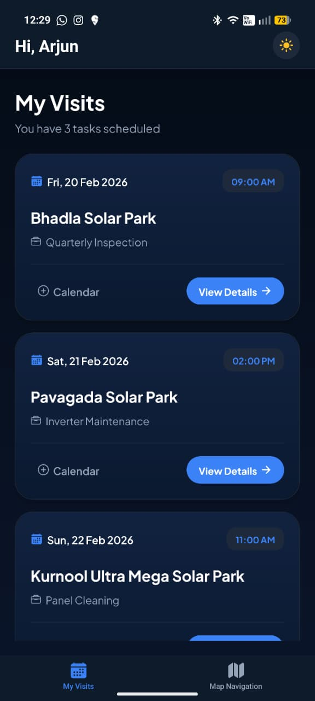 | 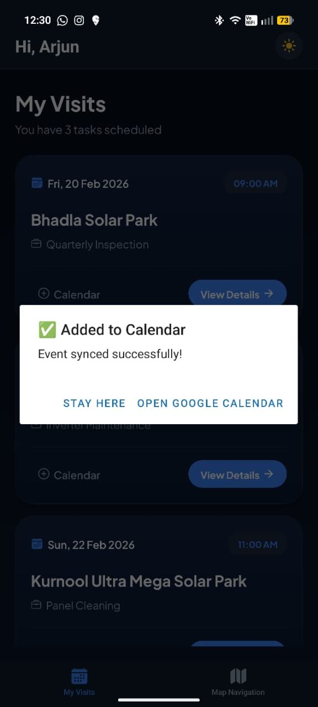 | 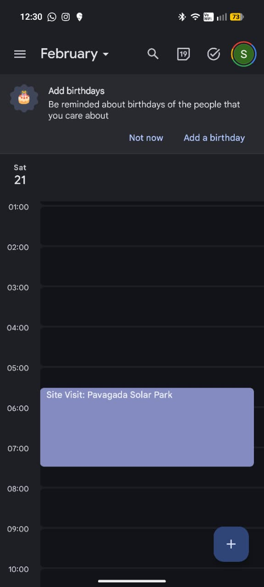 |
| 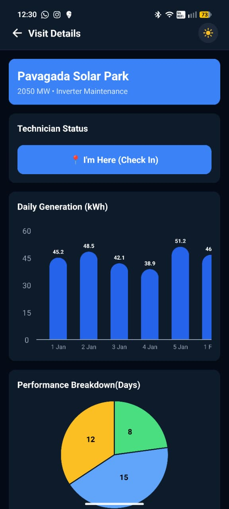 | 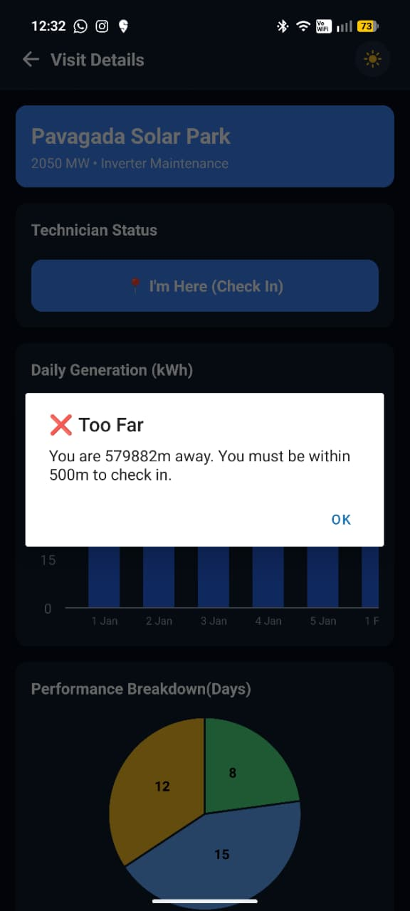 | 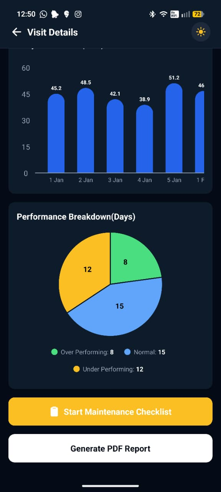 |
| 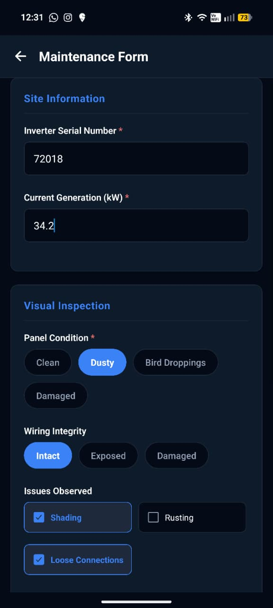 | 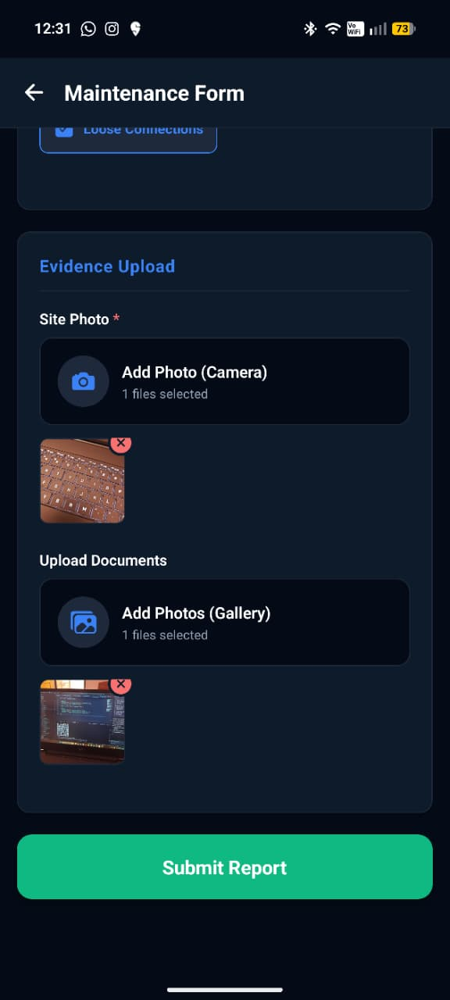 | 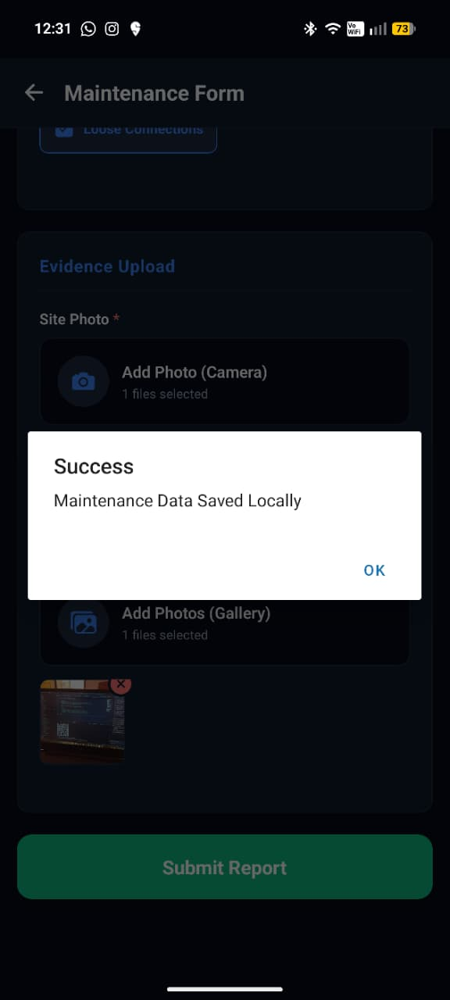 |
| 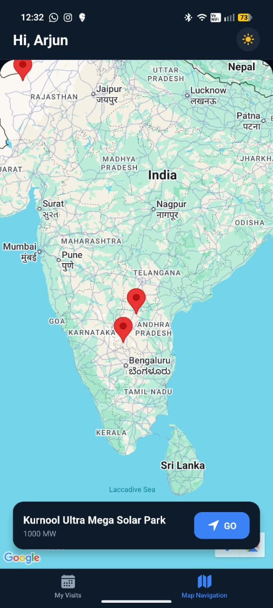| 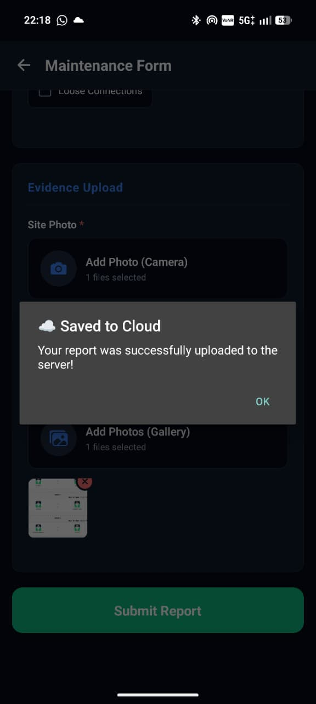 |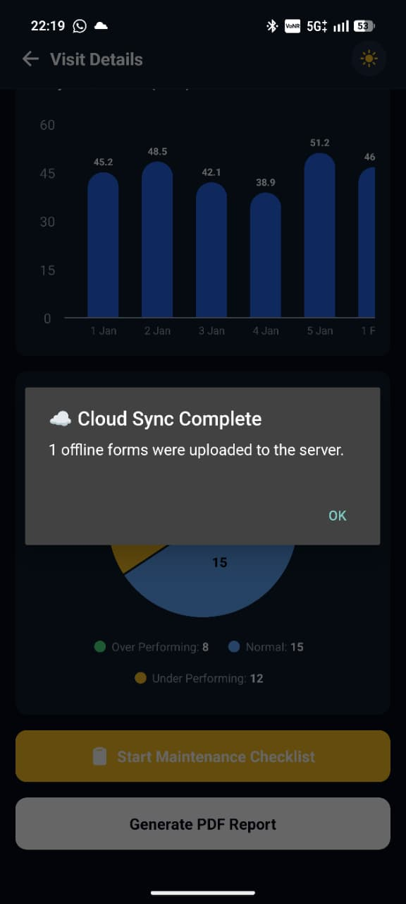 |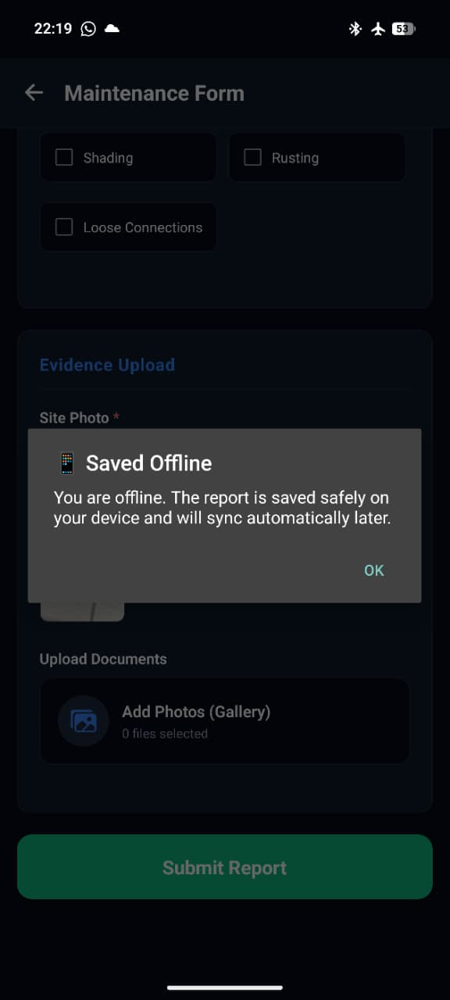 

## 3. Video Walkthrough
Below is the screen recording demonstrating the Level 1 flow (Calendar -> Site Visit -> Check-in).

## 2. Screenshots
Below are the key screens from the Level 2 implementation.
| |  | |
||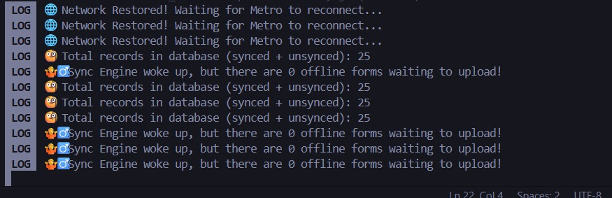|

